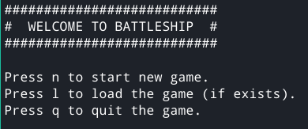
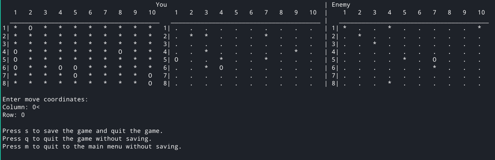

# Battleship



### Game rules

This version of Battleship can be played on a board of any size.

Each player at the beginning of the game receives a board with randomly placed ships, the ships can touch each other.

Each move the player chooses a specific cell on the opponent's board. If there is a part of a ship in the cell, 
then the cell is marked as hit, and the player is allowed to make one more move.

The winner is the player who is the first to hit all the cells with ships on the enemy board.

### Play the game



### Requirements

You must have Python 3.9+ to run the game.

### Run the game

```sh
$ python battleship.py
```
| Parameter | Description |
|--------------|-------------------------------|
| `-h`/`--help`| Prints help.                  |
| `-height`    | Sets the height of the board. |
| `-width`     | Sets the width of the board.  |
